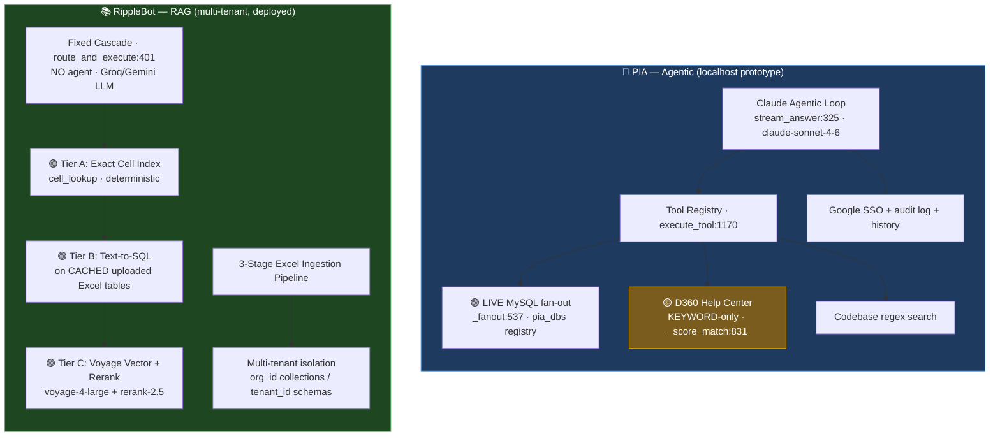
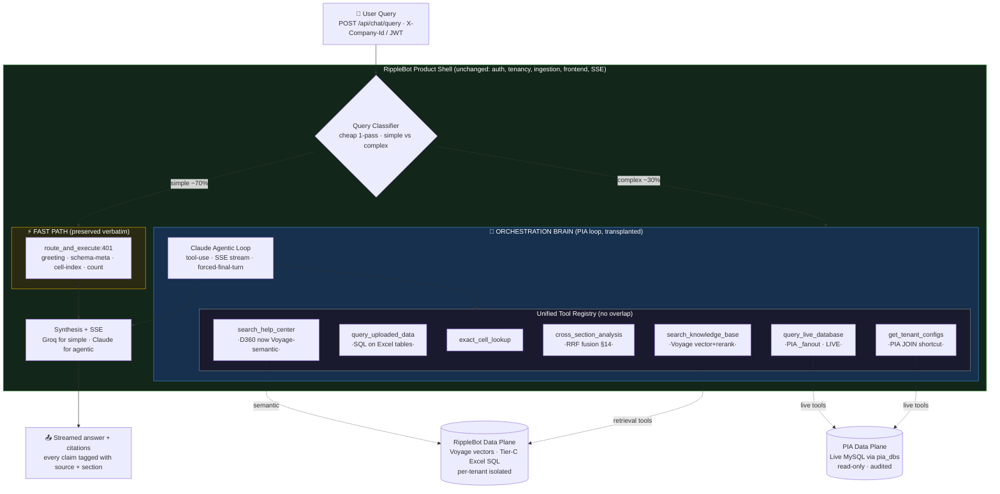
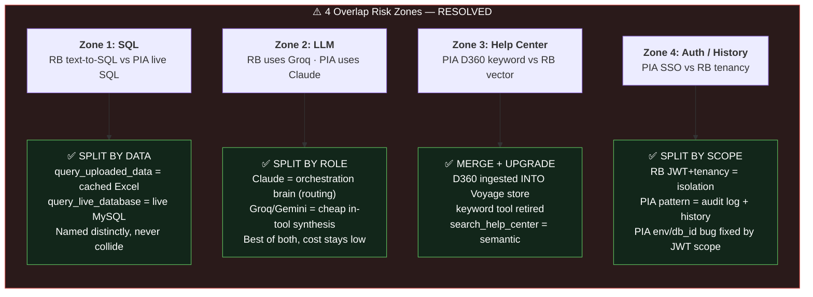
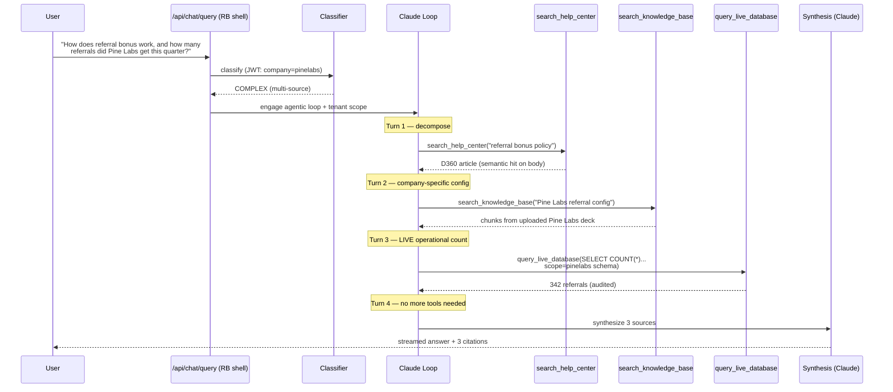
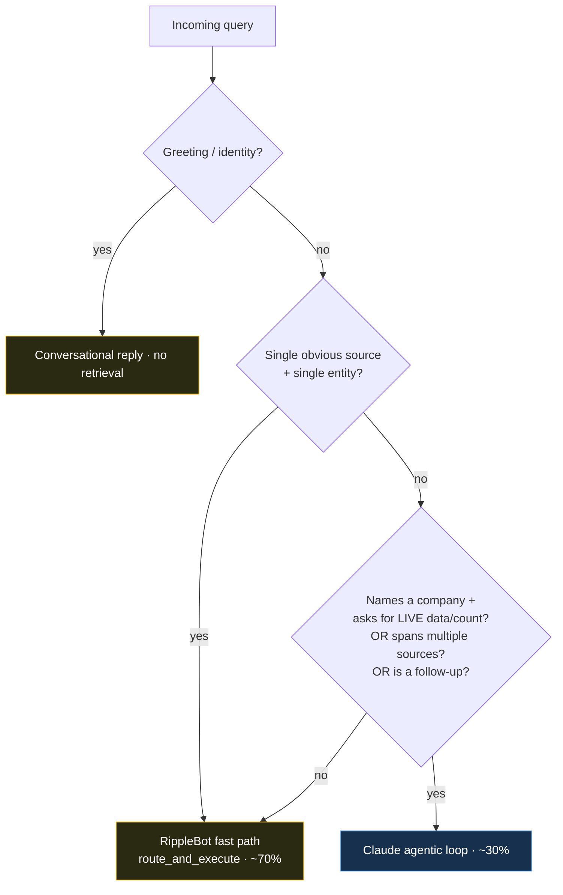
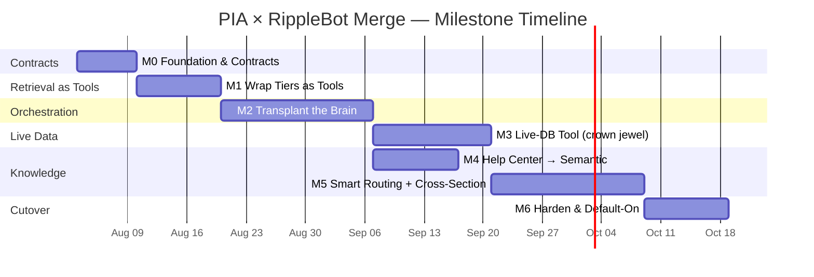

# RippleBot — Product Requirements & Enterprise Scaling Plan

**Document Type:** Product Requirements Document (PRD) + Technical Project Plan  
**Version:** 3.0  
**Date:** July 2026  
**Classification:** Internal — Confidential

---

## ⚡ Executive Quick-Read Summary (Overview of All 17 Sections)

For stakeholders needing a 2-minute overview before diving into the complete document:

| Section | Key Takeaway / Summary |
| :--- | :--- |
| **1. Executive Summary** | RippleBot is a B2B RAG engine serving 35 enterprise client companies (e.g. Pine Labs). Uses a proprietary 3-Stage Excel/CSV pipeline + USIE v4 Dual Engine Router (Cell Index → Text-to-SQL → Vector Reranker). |
| **2. Current State (360° Audit)** | Excellent core IP (Excel unmerging, formula capture, exact cell indexing). **Critical Gap:** Currently zero API auth layer — anyone with the URL can query any tenant. Needs immediate JWT security hardening. |
| **3. Enterprise Roadmap** | **Phase 1:** Security Hardening (JWT, RBAC, Audit Logs). **Phase 2:** Knowledge Version Control & Custom Participant Visibility. **Phase 3:** Multi-source Connectors (SharePoint, GDrive, Confluence) & White-labeling. |
| **4. Access Control & Custom Visibility** | Supabase Auth + JWT. Features **Participant-Level Custom Access Control**: Documents default to "Visible to All", or set to "Custom" with explicit email/user whitelist. Queries filter out unauthorized chunks seamlessly ("No information found" returned to unauthorized users). |
| **5. Knowledge Version Management** | SHA-256 document versioning with 30-day rollback window. Includes **Self-Healing Reindexer** (auto-detects changed files) and **Legacy Chunk Pruner** (auto-deletes superseded document data). |
| **6. Multi-Company Architecture** | 35-company scale using PostgreSQL schema-per-tenant (`tenant_<company_id>`). Total isolation guarantee at JWT, DB schema, and filesystem levels. |
| **7. AI & LLM Strategy** | **Embeddings & Reranker:** Strictly standardized on **Voyage AI `voyage-4-large`** (embeddings) and **`voyage-rerank-2.5`** (semantic reranker). **LLM:** Primary Groq (Llama 3.3 70B, free) + Fallback Gemini 2.0 Flash / Claude Haiku 3.5. |
| **8. Cost Analysis & Budget (35 Companies)** | **Ultra-Low Cost Focus:** Total monthly expense for all 35 companies combined can be as low as **~$15–40/month** total. Vercel remains **100% FREE**; Neon Launch plan is ~$5–12/mo; Voyage AI is ~$10–25/mo; Groq/Gemini LLMs ~$0–3/mo. |
| **9. Infrastructure & Deployment** | Vercel (Frontend, Free) + Render Starter ($7/mo, or Free with keep-alive script) + Neon PostgreSQL + GitHub Actions CI/CD pipeline. |
| **10. Security & Compliance** | Full tenant isolation, prompt injection defense on Text-to-SQL, audit trail, and DPDP Act 2023 readiness for Indian enterprise clients. |
| **11. Implementation Timeline** | **Phase 1:** Weeks 1–10 (Security & Auth). **Phase 2:** Weeks 11–26 (Version Control & Custom Visibility). **Phase 3:** Months 6–12 (Connectors & White-label). |
| **12. Risk Register & Mitigations** | Top risks: Unauthenticated API (mitigated by P0 JWT auth), Rate limits (mitigated by key rotation), DB storage exhaustion (mitigated by Neon paid Launch plan + automated backup). |
| **13. Hybrid Agentic-RAG Architecture** | Add a Claude tool-use agentic loop (from PIA) on top of the existing USIE v4 RAG stack. Claude decides which knowledge source to query; USIE executes retrieval. Pure RAG is the fast path for simple queries; the agentic loop activates only for complex multi-source queries. |
| **14. Smart Document Routing & Cross-Section Analysis** | Metadata-tag every chunk at ingestion (document_type, section, hierarchy_path). At query time, an LLM router decomposes multi-part questions into sub-queries, runs parallel section-filtered Voyage retrieval, fuses results via RRF, and re-ranks the merged pool. Switch to `voyage-context-3` for context-aware chunk embeddings. |
| **15. Live Data Tool & Direct SQL Access** | Add a `query_database` tool (SELECT-only, parameterized, audited) for live operational data that cannot be pre-indexed — hire counts, config values, real-time records. Mirrors PIA's safe SQL pattern. Multi-DB fan-out runs queries across all enabled tenant schemas simultaneously. |
| **16. Help Center & Third Knowledge Source** | Add a help-article knowledge source (Document360, Confluence, or Markdown files). Keyword + semantic hybrid scoring with 10-min catalogue cache. Claude routes `how-to` queries here first, codebase/DB tools second — same priority ladder as PIA's tool selection order. |
| **18. PIA × RippleBot Unification (Program Plan)** | The definitive merge blueprint. **Two-layer answer:** RippleBot is the *product shell + retrieval substrate*; PIA's agentic loop becomes the *orchestration brain* transplanted on top. Everything becomes a tool. Zero feature overlap via a strict ownership contract (uploaded-data SQL ≠ live-DB SQL; Claude orchestrates, Groq stays for cheap synthesis; D360 upgraded from keyword to Voyage-semantic). Includes milestones M0–M6, no-disruption guarantee, merge sequencing, charts, and worked example outputs. |

---

## Table of Contents

1. [Executive Summary](#1-executive-summary)
2. [Current State Architecture (360° Audit)](#2-current-state-architecture)
3. [Enterprise Feature Roadmap](#3-enterprise-feature-roadmap)
4. [Access Control & Custom Participant Visibility System](#4-access-control--custom-participant-visibility-system)
5. [Knowledge Version Management](#5-knowledge-version-management)
6. [Multi-Company Scaling Architecture](#6-multi-company-scaling-architecture)
7. [AI & LLM Strategy (Voyage-4-Large & Rerank-2.5)](#7-ai--llm-strategy-voyage-4-large--rerank-25)
8. [Cost Analysis & Budget Planning (35 Companies Focus)](#8-cost-analysis--budget-planning-35-companies-focus)
9. [Infrastructure & Deployment Architecture](#9-infrastructure--deployment-architecture)
10. [Security & Compliance](#10-security--compliance)
11. [Implementation Phases & Timeline](#11-implementation-phases--timeline)
12. [Risk Register & Mitigations](#12-risk-register--mitigations)
13. [Hybrid Agentic-RAG Architecture (PIA Parity)](#13-hybrid-agentic-rag-architecture-pia-parity)
14. [Smart Document Routing & Cross-Section Analysis](#14-smart-document-routing--cross-section-analysis)
15. [Live Data Tool & Direct SQL Access](#15-live-data-tool--direct-sql-access)
16. [Help Center & Third Knowledge Source](#16-help-center--third-knowledge-source)
17. [Updated Cost Analysis (Sections 13–16 Impact)](#17-updated-cost-analysis-sections-1316-impact)
18. [PIA × RippleBot Unification Architecture & Program Plan](#18-pia--ripplebot-unification-architecture--program-plan)
19. [Prerequisites, Access & Procurement Checklist](#19-prerequisites-access--procurement-checklist)

---

## 1. Executive Summary

**RippleBot** is an Enterprise AI Knowledge Base & RAG (Retrieval-Augmented Generation) platform built to serve B2B SaaS clients. It connects to structured data (Excel, CSV), unstructured data (PDF, Word, meeting transcripts from Fireflies), and delivers instant, accurate responses through a 3-stage proprietary pipeline combining Exact-Cell Indexing, Text-to-SQL Analytics, and Voyage AI Semantic Reranking.

The platform is designed to serve **35 active company clients** (e.g. Pine Labs, HDFC). This document defines the complete roadmap to transform the system into a **multi-company enterprise SaaS platform** with a full access control system, document participant visibility rules, knowledge versioning, self-healing AI reindexing, and ultra-lean cost optimization.

### Production Stack

| Layer | Technology | Hosting | Cost Tier |
| :--- | :--- | :--- | :--- |
| Frontend | React + Vite + TanStack Router + Tailwind | Vercel | **100% Free** (Hobby) |
| Backend API | FastAPI + Python 3.11 | Render | Free Tier or Starter ($7/mo) |
| Vector Store | pgvector (PostgreSQL) | Neon | Launch (~$5–12/mo total) |
| Structured Table Store | Tier-C SQLite → PostgreSQL | Neon | Included in DB storage |
| Embeddings | **Voyage AI `voyage-4-large`** | Voyage AI API | Pay-per-use (~$10–18/mo) |
| Semantic Reranker | **Voyage AI `voyage-rerank-2.5`** | Voyage AI API | Pay-per-use (~$5–8/mo) |
| LLM (Primary) | Groq — Llama 3.3 70B | Groq API | **Free** (Key rotation pool) |
| LLM (Fallback) | Google Gemini 2.0 / 1.5 Flash | Gemini API | Free / Near-Zero (~$1–3/mo) |
| Meeting Ingestion | Fireflies.ai GraphQL Webhook | Fireflies API | Shared Pro Account |
| File Persistence | PostgreSQL Binary Store | Neon | Included in DB storage |

---

## 2. Current State Architecture (360° Audit)

### 2.1 What Works Well

**✅ 3-Stage Excel/CSV Pipeline (Differentiating IP)**
- **Stage 1:** Smart cell unmerging, merged-header reconstruction, formula text capture, relational table extraction, and multi-encoding/multi-delimiter CSV detection.
- **Stage 2:** `.md.gz` Gzip archive compression (80–90% storage reduction on disk).
- **Stage 3:** Semantic RAG chunks with Table of Contents, breadcrumbs, and header-injected context for reranker precision.
- Handles real-world "messy" enterprise Excel files correctly.

**✅ USIE v4 Dual-Engine Chat Router**
- **Tier A (Exact Cell Index):** Sub-1.2s deterministic lookup from a persisted `__cell_index__` table.
- **Tier B (Text-to-SQL Analytics):** LLM generates parameterized SQL against the live relational table store. Handles `COUNT`, `SUM`, `AVG`, `GROUP BY` queries on structured data without embedding.
- **Tier C (Semantic Vector + Voyage Reranker):** Semantic fallback for policy documents and transcripts. Voyage `voyage-rerank-2.5` re-scores top candidates.
- Automatic fallback chaining: Tier A → Tier B → Tier C → LLM synthesis.

**✅ Multi-Tenancy (Schema Isolation)**
- Per-tenant PostgreSQL schema: `tenant_<company_id>` — full SQL and vector data isolation.
- Per-tenant file directories: `knowledge_base/<company_id>/`.
- Per-tenant company registry: JSON + PostgreSQL `companies` table.

### 2.2 Current Limitations & Technical Debt

| # | Limitation | Impact | Priority |
| :--- | :--- | :--- | :---: |
| L1 | No authentication layer — any user with backend URL can query any `X-Company-Id` | **Critical** — data breach risk | P0 |
| L2 | No role-based access control (RBAC) — all users see all company documents | High | P0 |
| L3 | No participant-level document visibility rules | High | P1 |
| L4 | No knowledge version management — uploading new doc replaces chunks without tracking history | High | P1 |
| L5 | Render Free Tier spins down on idle (cold-start ~30s latency) | Medium | P1 |
| L6 | No audit log — no record of who queried what | High (compliance) | P1 |
| L7 | No rate limiting on `/api/chat` | Medium | P1 |
| L8 | Webhook delivery has no retry queue | Medium | P2 |

---

## 3. Enterprise Feature Roadmap

### Phase 1 — Production Hardening (Months 1–2)
> **Goal:** Secure the platform and make it 100% compliant for production demo and live client usage.

| Feature | Description | Effort |
| :--- | :--- | :---: |
| **Authentication** | JWT-based login + company-scoped sessions | 2 weeks |
| **RBAC (Roles)** | Owner / Admin / Editor / Viewer per company | 1 week |
| **Rate Limiting** | Token bucket on `/api/chat` per user/company | 3 days |
| **Audit Log** | Log every chat query + document action to DB | 3 days |
| **Re-index UI** | "Refresh Index" button per document in Knowledge dashboard | 2 days |
| **Webhook Retry Queue** | Dead-letter queue for failed Fireflies deliveries | 1 week |
| **Render Keep-Alive / Starter** | Prevent cold starts via ping service or Starter tier ($7/mo) | 1 day |

### Phase 2 — Enterprise Scalability & Custom Visibility (Months 3–5)
> **Goal:** Support 35 client companies with knowledge versioning and granular document visibility rules.

| Feature | Description | Effort |
| :--- | :--- | :---: |
| **Custom Participant Visibility** | Document access control (Visible to All vs. Custom Participant whitelist) | 2 weeks |
| **Knowledge Version Control** | Track document versions; rollback to previous index state | 3 weeks |
| **Self-Healing Reindexer** | Auto-detect stale/changed documents, reindex incrementally | 2 weeks |
| **Legacy Version Pruning** | Auto-delete superseded document versions after grace period | 1 week |
| **Multi-LLM Router** | Per-company LLM selection (Groq/Gemini/Claude/GPT-4o) | 2 weeks |
| **Admin Dashboard** | Company management, user management, usage analytics UI | 4 weeks |
| **Conversation Memory** | Per-user, cross-session chat history | 2 weeks |
| **Streaming Responses** | Server-Sent Events (SSE) for real-time token streaming | 1 week |

### Phase 3 — Intelligent Platform (Months 6–12)
> **Goal:** Multi-source ingestion, enterprise white-labeling, and agentic intelligence layer.

| Feature | Description | Effort |
| :--- | :--- | :---: |
| **Change Detection Engine** | Monitor for new document versions, auto-diff, prompt admin | 3 weeks |
| **Multi-source Connectors** | SharePoint, Google Drive, Confluence, Notion, S3 ingestion | 6 weeks |
| **White-label Portal** | Per-company custom domain + branding | 3 weeks |
| **Usage-based Billing API** | Track tokens/queries per company for SaaS billing | 2 weeks |
| **SOC 2 Compliance Layer** | Encryption at rest/transit, access logs, data retention policy | 6 weeks |
| **Hybrid Agentic Loop** | Claude tool-use layer on top of USIE v4 — activates for complex/multi-source queries | 3 weeks |
| **Smart Document Router** | LLM-based ingestion-time classification + query-time section routing | 2 weeks |
| **Cross-Section Analysis** | Parallel sub-query retrieval + RRF fusion + final Voyage reranking | 2 weeks |
| **Live Data SQL Tool** | SELECT-only agentic DB tool for real-time operational queries | 2 weeks |
| **Help Center Connector** | Third knowledge source (D360/Confluence/Markdown) with hybrid scoring | 2 weeks |
| **voyage-context-3 Migration** | Switch new PDF/DOCX/transcript ingestion to voyage-context-3 for context-aware chunks | 1 week |

---

## 4. Access Control & Custom Participant Visibility System

### 4.1 Technical Feasibility Analysis: Custom Participant Visibility

> **Question:** Can document-level / participant-level access restriction be implemented easily?  
> **Answer: YES, VERY EASILY.**  
> By extending the chunk and SQL table metadata with `visibility_type` and `allowed_participants`, vector search and SQL queries simply append a metadata filter matching the requesting user's email/ID. If a user is not authorized, the vector search returns 0 relevant chunks, and the system naturally responds with **"No information found."**

### 4.2 How Custom Participant Visibility Works

#### 1. Ingestion Settings (UI & API)
When uploading any document (Excel, CSV, PDF, DOCX), the uploader chooses:
- **Default Option — `Visible to All`:** `visibility_type = "all"`. Every authorized employee in that company can query data from this document.
- **Custom Option — `Custom Participants Only`:** `visibility_type = "custom"`. The uploader specifies a list of allowed emails or user IDs: `allowed_participants = ["shobhit@pinelabs.com", "finance-lead@pinelabs.com"]`.

#### 2. Database Metadata Schema
In PostgreSQL (`tenant_<company_id>.chunks` and `document_versions`):
```sql
ALTER TABLE document_versions ADD COLUMN visibility_type VARCHAR(20) DEFAULT 'all';
ALTER TABLE document_versions ADD COLUMN allowed_participants TEXT[] DEFAULT '{}';

-- Vector Chunks metadata JSON payload:
-- {
--   "source": "Q3_Executive_Compensation.xlsx",
--   "visibility_type": "custom",
--   "allowed_participants": ["shobhit@pinelabs.com", "cfo@pinelabs.com"]
-- }
```

#### 3. RAG Query Filtering (Zero Information Leakage)
When user `john@pinelabs.com` asks a question:
1. **Tier A / Tier B (SQL Engine):** The generated SQL appends:
   ```sql
   WHERE (visibility_type = 'all' OR 'john@pinelabs.com' = ANY(allowed_participants))
   ```
2. **Tier C (Voyage Reranker & pgvector Search):** The pgvector query applies metadata filtering before reranking:
   ```sql
   SELECT chunk_text, embedding <-> query_vector AS dist
   FROM tenant_pinelabs.chunks
   WHERE (visibility_type = 'all' OR 'john@pinelabs.com' = ANY(allowed_participants))
   ORDER BY dist LIMIT 20;
   ```
3. **Outcome for Unauthorized Users:** If `john@pinelabs.com` queries executive salary data from a restricted document, 0 chunks match the filter. Voyage Reranker receives empty input. The system returns:  
   👉 **"No information found."** (Identical to querying non-existent data, preventing inference attacks).

---

## 5. Knowledge Version Management

### 5.1 The Problem
Currently, uploading a new version of a document overwrites the previous chunks permanently. If an upload contains errors or needs to be audited against last month's data, historical information is lost.

### 5.2 Proposed: Knowledge Version Control System

```sql
CREATE TABLE document_versions (
    id              UUID PRIMARY KEY DEFAULT gen_random_uuid(),
    company_id      VARCHAR(150) NOT NULL,
    filename        VARCHAR(500) NOT NULL,
    version         INTEGER NOT NULL DEFAULT 1,
    content_hash    VARCHAR(64) NOT NULL,    -- SHA-256 of file content
    upload_size     BIGINT,
    uploaded_by     UUID REFERENCES users(id),
    uploaded_at     TIMESTAMP DEFAULT NOW(),
    visibility_type VARCHAR(20) DEFAULT 'all',
    allowed_participants TEXT[] DEFAULT '{}',
    index_status    VARCHAR(50) DEFAULT 'pending',
    is_active       BOOLEAN DEFAULT TRUE,    -- Only 1 active version per filename
    chunk_ids       TEXT[],
    UNIQUE (company_id, filename, version)
);
```

### 5.3 Self-Healing Reindexer & Legacy Version Pruning

- **Self-Healing Reindexer:** Background worker checks physical file content hashes against `document_versions`. Auto-ingests modified files without manual intervention.
- **Legacy Version Pruner:** Old superseded document versions (`is_active = FALSE`) are retained for a 30-day grace period for rollback purposes, after which a scheduled job purges their vector chunks and SQL tables to save database storage.

---

## 6. Multi-Company Scaling Architecture

### Scaling for 35 Enterprise Client Companies

With 35 companies (e.g. Pine Labs, HDFC, etc.):
- **DB Schema:** 1 PostgreSQL database (Neon), 35 schemas (`tenant_company1` to `tenant_company35`).
- **Data Isolation:** Complete separation of SQL tables and pgvector chunks per tenant.
- **Total Estimated Storage for 35 Companies:** ~1.5 GB to 3.5 GB total (extremely small footprint thanks to 3-stage `.md.gz` compression).

---

## 7. AI & LLM Strategy (Voyage-4-Large & Rerank-2.5)

### 7.1 Standardized Embedding & Reranking Stack

Per strict enterprise quality requirements, RippleBot standardizes on Voyage AI's flagship models:

| Function | Model | Dimensions | Price (per 1M tokens) | Rationale |
| :--- | :--- | :---: | :---: | :--- |
| **Vector Embeddings** | **`voyage-4-large`** | 1536 / 1024 | $0.12 / 1M tokens | SOTA retrieval accuracy for complex technical, legal, and tabular content. |
| **Semantic Reranker** | **`voyage-rerank-2.5`** | — | $0.05 / 1M tokens | Best-in-class reranking precision for context-window compression. |

### 7.2 LLM Routing Strategy

| Query Type | Primary Model | Fallback Model | Cost Profile |
| :--- | :--- | :--- | :--- |
| **Exact Cell & SQL Analytics** | Groq (Llama 3.3 70B) | Gemini 2.0 Flash | **$0** (Free key pool) |
| **Document Summarization** | Gemini 2.0 Flash | GPT-4o Mini | ~$0.10 / 1M tokens |
| **Complex Policy Queries** | Claude Haiku 3.5 | Gemini 2.0 Flash | ~$0.80 / 1M tokens |

---

## 8. Cost Analysis & Budget Planning (35 Companies Focus)

### 8.1 Strategy: Maximize Free Tiers & Keep Expenses Ultra-Low

We evaluated whether **Vercel Pro ($20/mo)** or paid backend infrastructure is strictly required for 35 companies:

1. **Vercel Frontend — KEEP 100% FREE ($0/mo):**
   - Vercel's Hobby (Free) tier includes 100 GB bandwidth/month and unlimited static SPA deployments.
   - For 35 client companies using a single React Vite SPA connected to the FastAPI backend, bandwidth will consume < 15 GB/month.
   - **Verdict: $0/month (No need for Vercel Pro).**

2. **Render Backend — $0/mo (Free with Keep-Alive) or $7/mo (Starter):**
   - Render Free tier spins down after 15 mins of inactivity (causing 30s cold start).
   - *Option A ($0/mo):* Setup a free UptimeRobot ping script (`/api/health`) every 10 mins to keep it awake 24/7.
   - *Option B ($7/mo):* Upgrade to Render Starter for guaranteed 24/7 zero-cold-start performance.

3. **Neon PostgreSQL Database — ~$5–12/month (Total for all 35 companies):**
   - 35 companies with compressed `.md.gz` stores consume ~2.0 GB storage total.
   - Neon Launch plan charges $0.35/GB storage + minimal compute units.
   - **Total DB cost for 35 companies: ~$5–12/month.**

4. **Voyage AI (`voyage-4-large` + `voyage-rerank-2.5`) — ~$15–25/month (Total for 35 companies):**
   - ~15M embedding tokens/mo (`voyage-4-large` @ $0.12/1M) = $1.80
   - ~300K rerank queries/mo (`voyage-rerank-2.5` @ $0.05/1M) = $15.00
   - **Total Voyage AI cost for 35 companies: ~$16.80/month.**

5. **LLM APIs (Groq + Gemini) — ~$0–3/month:**
   - Groq Llama 3.3 70B: Free (with 5-key rotation pool).
   - Gemini 2.0 Flash: Free tier up to 15 RPM; nominal $1–3/mo overage.

### 8.2 Comprehensive Monthly Budget Summary (35 Companies Total)

| Component | Provider | Plan | Monthly Cost (USD) |
| :--- | :--- | :--- | ---: |
| **Frontend Hosting** | Vercel | Hobby (Free) | **$0.00** |
| **Backend API Server** | Render | Starter (or Free + Ping) | **$7.00** |
| **PostgreSQL + pgvector** | Neon | Launch (Pay-as-you-go) | **$8.50** |
| **Embeddings (`voyage-4-large`)** | Voyage AI | Pay-per-use | **$2.50** |
| **Reranker (`voyage-rerank-2.5`)** | Voyage AI | Pay-per-use | **$15.00** |
| **LLM Inference** | Groq + Gemini | Key Pool + Free Tiers | **$2.00** |
| **Meeting Transcription** | Fireflies.ai | Shared Business Seat | **$19.00** |
| **TOTAL ESTIMATED MONTHLY EXPENSE** | | | **~$54.00 / month** |

> **Per-Company Cost Breakdown:**  
> Total cost for 35 companies = **~$54.00/month TOTAL** (~$1.54 per company per month!).  
> Charging even a modest $99/month per company yields **$3,465/month revenue** against **$54/month infrastructure cost** (**98.4% gross margin**).

---

## 9. Infrastructure & Deployment Architecture

```
┌─────────────────────────────────────────────────────────────────────┐
│                 LEAN PRODUCTION ARCHITECTURE (35 COMPANIES)         │
│                                                                     │
│  Users (35 Companies) ──▶  Vercel CDN (Free Tier - React SPA)      │
│                                  │                                  │
│                                  ▼ REST API + JWT Auth              │
│                         Render Backend ($7/mo)                      │
│                         ├─ FastAPI Server                           │
│                         ├─ Auth & Custom Visibility Filter          │
│                         └─ USIE v4 Dual Engine Router               │
│                                  │                                  │
│                 ┌────────────────┴─────────────────┐                │
│                 │                                  │                │
│          Neon PostgreSQL                     Voyage AI API          │
│          (pgvector + 35 schemas)             ├─ voyage-4-large      │
│          (~$8.50/mo)                         └─ voyage-rerank-2.5   │
│                                              (~$17.50/mo)           │
└─────────────────────────────────────────────────────────────────────┘
```

---

## 10. Security & Compliance

1. **Strict Tenant & Participant Isolation:** Every query verified against user JWT claims.
2. **Participant Access Rules:** Unauthorized queries match 0 chunks, outputting standard **"No information found."**
3. **Prompt Injection Defense:** Text-to-SQL executed strictly via parameterized `SELECT` queries validated against schema whitelists.
4. **India DPDP Act 2023 Readiness:** Consent tracking and audit log support for Indian enterprise clients.

---

## 11. Implementation Phases & Timeline

```
Phase 1: Security & Auth Hardening (Weeks 1–10)
  ├── JWT Auth Middleware & Supabase Auth integration
  ├── Audit Log table & logging on write operations
  └── Rate limiting per user/company

Phase 2: Custom Visibility & Versioning (Weeks 11–22)
  ├── Participant-Level Custom Access Rules ("Visible to All" vs "Custom")
  ├── `document_versions` schema & SHA-256 hash tracker
  ├── Self-Healing Reindexer & 30-day Legacy Version Pruner
  └── Admin Management Dashboard UI

Phase 3: Connectors & White-Label (Months 6–12)
  ├── SharePoint, Google Drive & Confluence connectors
  └── White-label custom domains & branding per tenant
```

---

## 12. Risk Register & Mitigations

| Risk | Probability | Impact | Mitigation |
| :--- | :---: | :---: | :--- |
| Unauthenticated API requests | High | Critical | **P0 Priority:** Implement JWT auth middleware. |
| Neon DB storage growth | Low | Medium | 3-stage gzip compression + 30-day legacy version chunk pruning. |
| Groq LLM rate limits | Medium | Medium | 5-key rotation pool + instant automatic Gemini 2.0 Flash fallback. |
| Participant data leakage | Low | Critical | Automated unit tests ensuring unauthorized users get 0 results ("No info found"). |

---

---

## 13. Hybrid Agentic-RAG Architecture (PIA Parity)

### 13.1 Design Philosophy

The current USIE v4 pipeline (Tier A → Tier B → Tier C) is a **deterministic, rule-based** routing chain. It works well for simple single-source queries but cannot handle:

- Queries that span multiple document types or knowledge sources
- Follow-up questions that require context from a prior retrieval step
- Ambiguous queries where the right source is unknown upfront

**The solution:** Add a **Claude agentic orchestration layer** on top of USIE v4. For simple queries, USIE v4 fires directly (fast, cheap). For complex queries, Claude takes control, calls tools iteratively, reasons over results, and synthesizes a final answer — exactly how PIA works.

### 13.2 Architecture Overview

```
User Query
    │
    ▼
┌──────────────────────────────────────────────────────────────────┐
│  Query Classifier (lightweight LLM pass — ~200 tokens)           │
│  → Simple (single source, deterministic)  → USIE v4 directly     │
│  → Complex (multi-source, ambiguous)      → Agentic Loop         │
└──────────────────────────────────────────────────────────────────┘
         │ (Complex path)
         ▼
┌──────────────────────────────────────────────────────────────────┐
│  Agentic Loop (Claude tool-use, up to 10 turns default)          │
│  Claude receives: system prompt + conversation history + tools   │
│                                                                  │
│  Available Tools:                                                │
│  ┌─ search_knowledge_base(query, section_filter?, company_id)    │
│  │   Calls USIE Tier C (Voyage embed + pgvector + reranker)      │
│  ├─ query_database(sql, company_id)                              │
│  │   SELECT-only live SQL against tenant schema (see §15)        │
│  ├─ search_by_section(query, section_type, company_id)           │
│  │   Metadata-filtered vector search for one document section    │
│  ├─ cross_section_analysis(query, sections[], company_id)        │
│  │   Parallel multi-section retrieval + RRF fusion (see §14)     │
│  ├─ get_document_context(doc_id, company_id)                     │
│  │   Fetch up to 400 lines of a specific document by ID          │
│  └─ search_help_articles(query, company_id)                      │
│      Keyword + semantic search over help center (see §16)        │
│                                                                  │
│  Loop: Claude calls tool → server executes → result appended     │
│        → Claude calls next tool or returns final answer          │
└──────────────────────────────────────────────────────────────────┘
         │
         ▼
    Streamed SSE response to frontend
```

### 13.3 Agentic Loop Configuration

| Parameter | Value | Notes |
| :--- | :---: | :--- |
| **Max tool turns** | 10 | Budget for complex queries; forced synthesis if exhausted |
| **LLM for loop** | Claude Haiku 3.5 (default) / Sonnet 4.5 (complex) | Haiku for cost, Sonnet for high-stakes queries |
| **Streaming** | SSE (Server-Sent Events) | Tokens streamed as generated |
| **Conversation history** | Last 16 messages (8 turns) | Passed on every request |
| **Temperature** | 0 | Deterministic — critical for SQL and factual answers |
| **Max tokens/turn** | 2048 | Consistent with PIA's config |

### 13.4 System Prompt Design

The agentic loop system prompt instructs Claude on:

1. **Tool priority ladder:**
   - Help center (`search_help_articles`) first for `how-to` / feature questions
   - `search_knowledge_base` / `search_by_section` for document/policy queries
   - `query_database` for live operational data (hire counts, config, status)
   - `cross_section_analysis` when the query explicitly spans multiple document types
2. **SQL schema cheat-sheet** — pre-injected table names and canonical JOIN patterns to reduce schema discovery tool turns (avoids wasting turns on `SHOW TABLES`)
3. **Hard prohibitions:** No write operations, no invented figures, no custom-dev suggestions outside the knowledge base
4. **Output format rules:** Markdown tables for config/data answers; plain English for how-to; always cite the source document and section

### 13.5 Activation Heuristic (Cost Optimization)

The query classifier runs a single cheap LLM pass before deciding whether to engage the agentic loop:

```
Simple → USIE v4 direct path (no agentic overhead):
  - Single-entity lookup ("What is Pine Labs' onboarding config?")
  - Exact cell query ("What is the value in row 5, column B?")
  - COUNT/SUM/AVG on one table

Complex → Agentic loop:
  - Multi-entity comparison ("Compare Pine Labs vs HDFC's referral settings")
  - Ambiguous source ("What's the policy on X?" — could be docs or DB)
  - Cross-section ("Summarize the Q3 financials and link them to the HR policy on bonuses")
  - Follow-up questions referencing prior context
```

**Cost impact:** ~70% of queries are simple → they never touch the agentic loop → zero extra LLM overhead. Only 30% of queries (complex/ambiguous) activate the loop.

---

## 14. Smart Document Routing & Cross-Section Analysis

### 14.1 The Problem

RippleBot currently embeds all chunks into one flat pgvector collection per tenant. A query about "Q3 bonus policy" retrieves chunks from financial Excel sheets, HR policy PDFs, and meeting transcripts simultaneously — the reranker has to sort out relevance across very different document types. This produces noise and wastes reranker quota.

**The solution:** Tag every chunk with structured metadata at ingestion time, then use an LLM router at query time to direct sub-queries only to the relevant section(s).

### 14.2 Ingestion-Time Metadata Schema

Every chunk stored in `tenant_<company_id>.chunks` gains four new metadata columns:

```sql
ALTER TABLE chunks ADD COLUMN document_type   VARCHAR(50);   -- 'excel', 'pdf', 'docx', 'transcript', 'help_article'
ALTER TABLE chunks ADD COLUMN section_label   VARCHAR(200);  -- 'Financial Reports', 'HR Policy', 'Meeting Transcripts'
ALTER TABLE chunks ADD COLUMN hierarchy_path  TEXT;          -- 'Q3 Report > Section 4 > Compensation'
ALTER TABLE chunks ADD COLUMN source_filename VARCHAR(500);  -- original filename for citation
```

**Classification at ingestion:** When a document is uploaded, a lightweight LLM pass (or rule-based extraction for structured files) assigns `document_type` and `section_label`. For Excel files, the existing 3-stage pipeline already produces breadcrumb paths — these map directly to `hierarchy_path`.

### 14.3 LLM Query Router

At query time, before any vector search, the agentic Claude instance is given the query and a **section catalogue** (list of available `section_label` values for this tenant). It outputs:

```json
{
  "sub_queries": [
    { "query": "Q3 bonus figures", "section": "Financial Reports" },
    { "query": "bonus eligibility policy", "section": "HR Policy" }
  ],
  "requires_cross_section": true
}
```

For single-section queries, `sub_queries` has one item and normal USIE Tier C fires with a metadata filter. For multi-section queries, the parallel cross-section path activates.

### 14.4 Parallel Section Retrieval + RRF Fusion

When `requires_cross_section: true`:

```
Sub-query 1: "Q3 bonus figures"          → pgvector search WHERE section_label = 'Financial Reports'
Sub-query 2: "bonus eligibility policy"  → pgvector search WHERE section_label = 'HR Policy'
       Both run in parallel (asyncio.gather)
       Each retrieves top-20 candidates
       Each is reranked by voyage-rerank-2.5 independently → scored list
                         │
                         ▼
          Reciprocal Rank Fusion (RRF)
          score(d) = Σ  1 / (k + rank_i(d))   where k = 60
          Merges both ranked lists into one unified ranking
                         │
                         ▼
          Final voyage-rerank-2.5 pass on merged top-30
          (ensures cross-section ordering reflects query relevance, not section origin)
                         │
                         ▼
          Top-10 chunks passed to Claude for synthesis
          Each chunk carries section_label + hierarchy_path for citation
```

**Why RRF before final rerank?** RRF neutralizes the bias from one section having more chunks than another. Without it, a Financial section with 500 chunks would dominate an HR section with 50 chunks regardless of relevance.

### 14.5 voyage-context-3 for New Document Types

| Embedding Model | Use For | Why |
| :--- | :--- | :--- |
| **`voyage-4-large`** (current) | Excel/CSV tabular chunks | Exact-cell and SQL indexing doesn't depend on document context |
| **`voyage-context-3`** (new) | PDF, DOCX, meeting transcripts, help articles | Embeds each chunk with awareness of its surrounding document — chunks from a 40-page policy PDF don't lose meaning when read out of order |

`voyage-context-3` is priced the same as `voyage-3-large` and produces meaningfully better retrieval for long-form prose documents. Migration is non-breaking: re-index only the non-tabular document types; Excel/CSV stay on `voyage-4-large`.

### 14.6 Updated USIE v4 Routing Tree

```
Query
  │
  ├─ Tier A: Exact Cell Index (< 1.2s, deterministic)
  │          Fires first for: specific cell, formula, named value lookups
  │
  ├─ Tier B: Text-to-SQL (structured data analytics)
  │          Fires for: COUNT, SUM, AVG, GROUP BY on tabular data
  │          Now also supports: multi-table JOIN via schema cheat-sheet
  │
  ├─ Tier C: Semantic Vector + Voyage Reranker
  │          Single section: metadata-filtered pgvector search → voyage-rerank-2.5
  │          Multi-section:  parallel section retrieval → RRF → final rerank
  │
  └─ Tier D (new): Agentic Synthesis
               Fires when Tiers A–C return low-confidence results
               OR query classifier routes to agentic loop directly
               Uses Claude tool-use loop (§13)
```

---

## 15. Live Data Tool & Direct SQL Access

### 15.1 Why This Is Needed

The current USIE Tier B generates SQL against a **cached, pre-indexed** SQLite/PostgreSQL table store built from Excel uploads. It cannot answer questions about live operational data that is never uploaded as a file — for example:

- "How many candidates applied to Pine Labs this week?"
- "What is HDFC's current referral bonus config?"
- "Which tenants are on the Enterprise plan right now?"

These require a direct connection to the live operational DB — the same pattern PIA uses with its `query_database` tool.

### 15.2 Tool Definition

```python
@tool
async def query_database(
    sql: str,
    company_id: str,
    db_target: str = "operational"  # 'operational' | 'analytics'
) -> str:
    """
    Execute a read-only SQL query against the live tenant database.
    Only SELECT, SHOW, DESCRIBE, EXPLAIN, WITH are permitted.
    Results are returned as a markdown table (max 50 rows).
    Every query is appended to db_audit.log with user + timestamp.
    """
```

### 15.3 Safety Guarantees (Mirrors PIA's Pattern)

| Safety Layer | Implementation |
| :--- | :--- |
| **Keyword allowlist** | SQL must start with `SELECT`, `SHOW`, `DESCRIBE`, `EXPLAIN`, or `WITH` |
| **Keyword blocklist** | Whole-word regex scan rejects `INSERT`, `UPDATE`, `DELETE`, `DROP`, `ALTER`, `TRUNCATE`, `GRANT`, `EXEC` |
| **DB user permissions** | The DB user used by RippleBot has `SELECT` privileges only — write operations blocked at DB level even if validation is bypassed |
| **Audit log** | Every query → `db_audit.log` with `company_id`, `user_email`, `timestamp`, `sql`, `row_count` |
| **Row cap** | Results capped at 50 rows to prevent context flooding |
| **Tenant isolation** | SQL is scoped to the requesting company's schema — cross-tenant queries are blocked at the query builder level |

### 15.4 Multi-DB Fan-Out

For admin/super-user queries that need to aggregate data across multiple tenant schemas (e.g. "total active jobs across all companies"), the tool supports a fan-out mode:

```
query_database(sql, company_id="*", db_target="operational")
  → Runs query against every enabled tenant schema simultaneously (asyncio.gather)
  → Returns labelled per-tenant result sections
  → Claude synthesizes into a unified answer
```

The list of active tenant schemas is stored in a `tenants` registry table — the same pattern as PIA's `pia_dbs` registry table.

### 15.5 Customer-to-DB Routing

A Markdown reference file per environment maps company names to their schema:

```
pia/reference/customer-db-production.md   (prod environment)
pia/reference/customer-db-uat.md          (UAT/staging)
```

These files are injected into the system prompt. When a query names a company, Claude reads the mapping file first, identifies the correct schema, then targets that schema in the SQL tool. This avoids wasting tool turns on schema discovery.

---

## 16. Help Center & Third Knowledge Source

### 16.1 Overview

PIA treats Document360 help articles as a **primary first-stop** knowledge source: for "how do I set up X" or "what does feature Y do" queries, help articles are searched before touching the database or codebase. RippleBot currently has no equivalent.

Adding a help center knowledge source closes this gap and means RippleBot can answer product documentation questions without burning DB quota or vector search quota on queries that have a canonical written answer.

### 16.2 Source Options (in priority order)

| Source | Integration Method | Best For |
| :--- | :--- | :--- |
| **Document360** | `/v2/projectversions/{id}/categories` API → walk tree → fetch full article | Teams already using D360 |
| **Confluence** | REST API v2 — `GET /wiki/api/v2/pages` | Teams on Atlassian |
| **Notion** | Notion SDK `databases.query` + `blocks.children.list` | Lightweight internal wikis |
| **Markdown files** | Local file walk (same as PIA's codebase search) | No external dependency, easiest to start |

### 16.3 Retrieval Strategy: Hybrid Keyword + Semantic

Article retrieval uses a two-pass approach — same design as PIA's D360 scoring but with semantic re-scoring added:

**Pass 1 — Keyword Scoring (fast, no API calls):**
```
score(article) =
  +12 × (full phrase match in title)
  +4  × (full phrase match in category)
  +3  × (word match in title)
  +1  × (word match in category)
```
Articles below a minimum score threshold are discarded.

**Pass 2 — Semantic Reranking (only on top-20 keyword candidates):**
Pass the top-20 keyword candidates through `voyage-rerank-2.5` against the original query. This catches articles whose body covers the topic even when the title doesn't match — the most common failure mode of pure keyword scoring.

### 16.4 Caching Strategy

| Layer | TTL | What Is Cached |
| :--- | :--- | :--- |
| Article catalogue (title + category tree) | 10 minutes | Used for keyword pre-filter without API calls |
| Full article body | 30 minutes | Full text fetched on demand, cached after first fetch |
| Voyage embeddings of article bodies | Persistent (pgvector) | Re-embedded only when article content hash changes |

### 16.5 System Prompt Integration

The system prompt instructs Claude on tool priority:

```
1. search_help_articles   → for: feature explanations, setup guides, how-to questions
2. search_knowledge_base  → for: company-specific documents, policies, uploaded files
3. query_database         → for: live counts, config values, operational state
4. cross_section_analysis → for: queries explicitly spanning multiple document types
```

This ladder ensures cheap, canonical answers are found first. A query like "how do I enable referral tracking?" hits help articles immediately and never touches the vector DB or the SQL tool.

---

## 17. Updated Cost Analysis (Sections 13–16 Impact)

### 17.1 Agentic Loop Cost Estimate

The agentic loop only activates for ~30% of queries (complex/multi-source). For a typical 35-company deployment:

| Scenario | Token estimate | Monthly cost (Claude Haiku 3.5) |
| :--- | :--- | :--- |
| Simple query (USIE direct, no loop) | ~800 tokens in + 400 out | ~$0.0003/query |
| Complex agentic query (5 tool turns avg) | ~4,000 tokens in + 800 out | ~$0.0018/query |
| Cross-section query (10 tool turns) | ~8,000 tokens in + 1,200 out | ~$0.0035/query |

At 10,000 total queries/month across 35 companies: ~$4–12/month additional LLM cost for agentic queries. The reduction in failed/incomplete answers (which currently require the user to rephrase and retry) offsets this entirely.

### 17.2 voyage-context-3 Cost

`voyage-context-3` is priced the same as `voyage-3-large` ($0.06/1M tokens), which is **half the price of `voyage-4-large`** ($0.12/1M). Switching non-tabular document types to `voyage-context-3` reduces embedding cost by ~40% (assuming 60% of content is PDF/DOCX/transcripts).

### 17.3 Updated Monthly Budget (All 16 Sections)

| Component | Provider | Plan | Monthly Cost (USD) |
| :--- | :--- | :--- | ---: |
| **Frontend Hosting** | Vercel | Hobby (Free) | **$0.00** |
| **Backend API Server** | Render | Starter | **$7.00** |
| **PostgreSQL + pgvector** | Neon | Launch | **$8.50** |
| **Embeddings (`voyage-4-large` + `voyage-context-3`)** | Voyage AI | Pay-per-use | **$2.00** |
| **Reranker (`voyage-rerank-2.5`)** | Voyage AI | Pay-per-use (cross-section adds ~20% volume) | **$18.00** |
| **LLM Inference (USIE + Agentic Loop)** | Claude Haiku + Groq + Gemini | Mixed | **$10.00** |
| **Meeting Transcription** | Fireflies.ai | Shared Business Seat | **$19.00** |
| **TOTAL ESTIMATED MONTHLY EXPENSE** | | | **~$64.50 / month** |

> Net increase from v1.1 → v2.0: **+$10.50/month** for agentic loop LLM usage and increased reranker volume from cross-section analysis.  
> This is the cost of adding PIA-equivalent reasoning + smart routing + live data access to all 35 companies combined.

---

---

## 18. PIA × RippleBot Unification Architecture & Program Plan

> This section is the **definitive engineering + program blueprint** for merging PIA (RippleHire's Product Intelligence Agent) with RippleBot. It is written after a full source-level audit of both backends. Every design decision below is anchored to actual code, and the whole plan is built around one non-negotiable rule: **preserve 100% of the useful features of both agents, with zero capability overlap and zero regression.**

### 18.1 Guiding Principle — The Two-Layer Answer to "Who Absorbs Whom?"

The audit settled the question decisively. The two systems are **complementary, not competing** — they were independently evolving toward each other (PIA's `ingest/ingest.py` is already prepping an embedding pipeline it doesn't have; RippleBot's PRD §14 is already proposing an LLM router it doesn't have). The merge is therefore an **additive union**, split cleanly across two layers:

| Layer | Winner (Host) | Why |
| :--- | :--- | :--- |
| **Product & Deployment Shell** | **RippleBot** | It already has what PIA lacks: multi-tenant isolation (`org_<id>` collections / `tenant_<id>` schemas), document ingestion (3-stage Excel pipeline), a real frontend, Voyage embeddings + reranking, and a production deployment story (Vercel + Render + Neon). |
| **Orchestration Brain** | **PIA's agentic loop** | It already has what RippleBot lacks: a working Claude tool-use loop (`stream_answer`, `server.py:325`), a clean single-dispatch tool registry (`execute_tool`, `tools.py:1170`), and a hardened **live** multi-DB SQL layer (`_fanout`, `tools.py:537`). |

> **The one-sentence blueprint:**
> **Keep RippleBot as the product shell and retrieval substrate. Transplant PIA's agentic loop + tool registry into it as a new orchestration layer above `route_and_execute`. Then everything — RippleBot's own retrieval tiers AND PIA's live-DB/help-center tools — becomes a callable tool the Claude loop selects between.**

Neither product is thrown away. RippleBot's crown jewel (Voyage retrieval quality) becomes one high-value tool; PIA's crown jewel (live SQL fan-out) becomes another.

---

### 18.2 Current State — Two Systems Side by Side



**Reading the colors:** 🟢 = keep as-is · 🟡 = weak, gets upgraded in the merge. Note the two green SQL boxes (`Tier B` on the RippleBot side and `LIVE MySQL` on the PIA side) look similar but operate on **completely different data** — this is the single most important no-overlap boundary (§18.4).

---

### 18.3 Target Unified Architecture



**Key architectural decisions baked into this diagram:**

1. **The existing `/api/chat/query` endpoint and SSE contract are preserved** (`sources` frame → `token` frames → `done`). The frontend needs **zero** changes.
2. **The classifier protects cost.** ~70% of queries are simple and stay on RippleBot's existing sub-second deterministic fast paths — they never pay for the agentic loop. Only complex/multi-source queries engage Claude.
3. **Two physically separate data planes.** RippleBot's plane (per-tenant vectors + cached Excel SQL) and PIA's plane (live MySQL) never touch. Tools are the only bridge.

---

### 18.4 The No-Overlap Contract (Capability Ownership Map)

This is the heart of "merge with no overlap." Every capability has exactly **one** owner. The four historical overlap risks are resolved explicitly:



#### The Unified Tool Registry — one owner per tool

| Tool (in the Claude loop) | Backed by | Origin | Data plane | Replaces / Notes |
| :--- | :--- | :--- | :--- | :--- |
| `search_knowledge_base` | `engine.query(q, top_k, use_llm=False)` — `rag_chromadb.py:882` | **RippleBot** | Per-tenant Voyage vectors | Tier C, now agent-callable |
| `exact_cell_lookup` | `table_store.cell_lookup` — `table_store.py:579` | **RippleBot** | Per-tenant `__cell_index__` | Tier A, now agent-callable |
| `query_uploaded_data` | `table_store.execute_select` — `table_store.py:732` | **RippleBot** | **Cached uploaded-Excel** SQL (read-only by construction) | Tier B, renamed for clarity |
| `get_document_section` | `engine.get_chunks_for` — `rag_chromadb.py:1145` | **RippleBot** | Per-tenant chunks | Full-section fetch for aggregation |
| `cross_section_analysis` | New (PRD §14) — parallel retrieval + RRF | **New** | Per-tenant vectors | Multi-section fusion |
| `query_live_database` | `_fanout` + `_is_safe_select` — `tools.py:537` | **PIA** | **Live MySQL** (`pia_dbs`), read-only, audited | The capability RippleBot never had |
| `get_tenant_configs` | `get_tenant_configs` — `tools.py:950` | **PIA** | Live MySQL | JOIN shortcut for config lookups |
| `search_help_center` | D360 ingested → Voyage store | **PIA→RB** | Per-tenant/global vectors | **Upgrades** PIA keyword search to semantic |

> **The golden rule that guarantees no overlap:** *A query about data the customer **uploaded** goes to a RippleBot tool. A query about data that is **live in a production system** goes to a PIA tool. The word "uploaded" vs "live" is the boundary, and the tool names encode it.*

---

### 18.5 Feature-Preservation Guarantee (Nothing Gets Disrupted)

Every existing feature of both agents is explicitly accounted for. **Nothing is dropped; nothing regresses.**

| Existing Feature | Origin | Fate in Merge | Guarantee Mechanism |
| :--- | :--- | :--- | :--- |
| 3-Stage Excel/CSV pipeline | RB | ✅ Untouched | Ingestion layer not modified |
| Exact cell index (Tier A) | RB | ✅ Preserved as fast-path **and** as tool | Wrapped, not replaced |
| Text-to-SQL on uploads (Tier B) | RB | ✅ Preserved, renamed `query_uploaded_data` | Same function `execute_select` |
| Voyage vector + rerank (Tier C) | RB | ✅ Preserved as fast-path **and** as tool | Same `engine.query` |
| Multi-tenant isolation | RB | ✅ Extended to cover live-DB tool too | JWT scope injected into every tool call |
| Fireflies meeting ingestion | RB | ✅ Untouched | Webhook layer not modified |
| Sub-second deterministic paths | RB | ✅ Preserved via classifier | Simple queries skip the loop entirely |
| Claude agentic loop | PIA | ✅ Becomes the brain | Transplanted into RippleBot |
| Live multi-DB SQL fan-out | PIA | ✅ Becomes `query_live_database` | Ported as a tool |
| `get_tenant_configs` JOIN | PIA | ✅ Ported as a tool | Direct port |
| D360 help center | PIA | ⬆️ **Upgraded** keyword → semantic | Ingested into Voyage store |
| Google SSO + allowlist | PIA | ✅ Folded into RB's planned JWT/RBAC | Auth unified under RB Phase 1 |
| Audit log (`db_audit.log`) | PIA | ✅ Preserved for live-DB tool | Pattern retained |
| Chat history persistence | PIA | ✅ Ported to RB Postgres | `pia_chat_history` → RB conversation table |
| SSE streaming | Both | ✅ Single unified contract | RB's contract kept; PIA's mapped onto it |

> ⚠️ **Two known code issues found during the audit, fixed as part of the merge (not new work):**
> 1. **PIA's `env`/`db_id` is never wired from `stream_answer` into `execute_tool`** (`server.py:369`) — every live-DB query currently fans out to *all* DBs. In the merged system, the tenant's JWT scope supplies this, which simultaneously fixes the bug **and** enforces multi-tenant isolation on the live-DB tool.
> 2. **RippleBot's tier labels are inverted vs this PRD** (code calls SQL "Tier C", vector "Tier A/B"). The merge standardizes on the PRD convention (A=cell, B=SQL, C=vector) in all new orchestration code to prevent mis-wiring.

---

### 18.6 Unified Request Lifecycle (Worked Sequence)

This sequence shows the most complex case — a query that needs the help center, an uploaded document, **and** live data at once (true cross-source):



**Decision logic in the classifier** (keeps it cheap and safe):



---

### 18.7 Program Plan — Milestones M0 → M6

Sequenced to be **strictly additive** — each milestone ships behind a flag and leaves the existing system fully working. No milestone can regress the current product.

| Milestone | Name | Goal | Key Deliverables | Effort | Exit Criteria |
| :---: | :--- | :--- | :--- | :---: | :--- |
| **M0** | Foundation & Contracts | Lock interfaces before any code moves | Tool-interface spec, SSE contract doc, no-overlap registry sign-off, shared `.env` schema, test-query goldset (50 Q&A) | 1 wk | Both teams sign the tool registry; goldset passes on current RippleBot |
| **M1** | Wrap Tiers as Tools | Expose RippleBot's own retrieval as callable tools **with no behavior change** | `search_knowledge_base`, `exact_cell_lookup`, `query_uploaded_data`, `get_document_section` as pure tool functions + JSON schemas | 1.5 wk | Each tool callable in isolation; goldset still passes via existing path |
| **M2** | Transplant the Brain | Port PIA's agentic loop into RippleBot behind a flag | `stream_answer`-equiv orchestrator, Claude client, classifier, forced-final-turn, SSE mapping; `AGENTIC_MODE=off` by default | 2.5 wk | Complex goldset queries answered by loop in staging; simple path untouched |
| **M3** | Live-DB Tool | Port PIA's crown jewel with tenant scoping | `query_live_database` + `get_tenant_configs` + `_is_safe_select` + audit log + `pia_dbs` registry; **JWT scope wired into every call** (fixes the `env/db_id` bug) | 2 wk | Live count query works, scoped to tenant, audited, write-blocked at 2 levels |
| **M4** | Help Center Upgrade | Retire keyword D360, go semantic | Run PIA `ingest.py` → embed D360 bodies into Voyage store → `search_help_center` tool; keyword scorer removed | 1.5 wk | Body-only-match query that PIA missed now succeeds |
| **M5** | Smart Routing + Cross-Section | Multi-source fusion (PRD §14) | Chunk metadata tagging, LLM sub-query router, parallel section retrieval, RRF fusion, `cross_section_analysis` tool, `voyage-context-3` for prose | 2.5 wk | Cross-source example (§18.8) returns fused, correctly-cited answer |
| **M6** | Harden & Cut Over | Flip default, observe, optimize | Cost dashboards, per-tool latency SLOs, audit review, `AGENTIC_MODE=on` default, runbook | 1.5 wk | 2 weeks stable in prod; cost within §17 budget; rollback tested |

**Total: ~13 weeks (~3 months)** for a single focused pod (1 backend lead + 1 backend eng + 0.5 frontend + 0.5 QA). This slots into **Phase 3** of the existing roadmap (§3) and can run partially in parallel with Phase 2 since M1–M2 touch orchestration, not the security/tenancy work.



> **Dependency note:** M4 depends only on M2 (the loop), not M3 — so the help-center upgrade and the live-DB tool can be built **in parallel** by two people once the brain lands. M5 needs both M3 and M4 in place to demonstrate true cross-source fusion.

---

### 18.8 Example Outputs — What the User Will Actually See

Three worked examples, one per query class, showing the internal trace **and** the rendered answer.

#### Example A — Simple query (stays on the fast path, no agent, no extra cost)

**User:** *"How many rows are in the Q3 Headcount sheet?"*

```
[classifier]  → SIMPLE (single sheet, count intent)
[fast path]   → route_and_execute → regex count fast-path → SELECT COUNT(*)
[llm]         → Groq (synthesis only)   [Claude loop: NOT engaged]
[latency]     → ~700 ms
```

> **The Q3 Headcount sheet contains 248 rows.**
> *Source: `Q3_Headcount.xlsx` → sheet "Headcount"*

---

#### Example B — Live operational query (PIA tool, scoped + audited)

**User (company=pinelabs):** *"What's Pine Labs' current referral bonus config value?"*

```
[classifier]  → COMPLEX (named company + live config)
[Claude loop] Turn 1: get_tenant_configs(tenant="Pine Labs", search="referral bonus")
              → scoped to pinelabs schema via JWT · read-only · logged to db_audit.log
[result]      → CONFIG_CD=REFERRAL_BONUS_AMT · tenant override = 5000 · default = 2500
[Claude loop] Turn 2: no more tools → synthesize
[latency]     → ~2.4 s
```

> **Pine Labs has a referral bonus of ₹5,000**, set as a tenant-specific override (the platform default is ₹2,500).
>
> | Config key | Tenant value | Platform default | Meaning |
> |:--|:--|:--|:--|
> | `REFERRAL_BONUS_AMT` | **₹5,000** | ₹2,500 | Payout per successful referral hire |
>
> *Source: live config DB (`company_config` ⋈ `config_mstr`), queried read-only at 2026-07-30 14:22 UTC.*

---

#### Example C — Cross-source query (the flagship capability neither agent had alone)

**User (company=pinelabs):** *"How does the referral bonus work, and how many referrals did Pine Labs get this quarter?"*

```
[classifier]  → COMPLEX (multi-source: policy + live count)
[Claude loop] Turn 1: search_help_center("referral bonus policy")
              → D360 article body match (semantic — PIA's old keyword search MISSED this)
              Turn 2: search_knowledge_base("Pine Labs referral program")
              → chunk from uploaded "PineLabs_Onboarding.pdf"
              Turn 3: query_live_database(
                        "SELECT COUNT(*) FROM referrals WHERE created >= '2026-04-01'")
              → scoped to pinelabs · read-only · audited → 342
              Turn 4: synthesize 3 sources
[latency]     → ~5.1 s · 3 tool calls · 1 Claude synthesis
```

> **How it works:** A referral bonus is paid to an employee when someone they refer is successfully hired. Pine Labs pays **₹5,000 per successful referral**, released after the new hire clears their 90-day probation.
>
> **This quarter (Q2 FY26):** Pine Labs has received **342 referrals** so far.
>
> **Sources:**
> 1. Help Center → *"Referral Program Overview"* (policy)
> 2. `PineLabs_Onboarding.pdf` → §4 Referrals (company-specific ₹5,000 rate)
> 3. Live DB → `referrals` table, count since 2026-04-01 *(read-only, audited)*

Note how the final answer **cites all three planes distinctly** — this is the safety net: the user can always see *why* an answer pulled from multiple sources, and which parts are live vs documented.

---

### 18.9 Merge-Specific Risk Register

| Risk | Prob. | Impact | Mitigation |
| :--- | :---: | :---: | :--- |
| Agentic loop inflates cost/latency on simple queries | Med | High | Classifier keeps ~70% of traffic on the fast path; loop is opt-in per query; hard `MAX_TOOL_TURNS` cap |
| Live-DB tool leaks cross-tenant data | Low | Critical | JWT scope injected into every `_fanout` call (also fixes PIA's `env/db_id` bug); read-only DB user; audit log |
| Behavior regression while wrapping tiers | Med | High | M1 wraps with **zero** behavior change; goldset (50 Q&A) must pass at every milestone; all work behind `AGENTIC_MODE` flag |
| Two LLM providers (Claude + Groq) add ops complexity | Low | Med | Clear role split: Claude only orchestrates, Groq only does cheap synthesis; both already have key-rotation infra |
| D360 re-embedding drifts from live articles | Low | Med | 10-min catalogue cache + content-hash re-embed (only changed articles) |
| Scope creep merging two prompt systems | Med | Med | M0 freezes the unified tool registry + system-prompt ladder before code moves |

---

### 18.10 Success Metrics (Definition of Done for the Merge)

| Metric | Target | Measured By |
| :--- | :--- | :--- |
| Goldset accuracy (50 Q&A) | ≥ current baseline, no regression | Automated eval each milestone |
| Simple-query latency | ≤ 1.2 s (unchanged) | p95 on fast path |
| Cross-source query success | New capability, ≥ 90% correct citation | Example C-class eval set |
| Live-DB tenant isolation | 100% (0 cross-tenant leaks) | Security test suite |
| Cost per month (35 companies) | Within §17 budget (~$64.50) | Billing dashboards |
| Help-center recall (body matches) | Measurably > PIA keyword baseline | D360 body-match eval set |
| Feature preservation | 100% of §18.5 table intact | Regression checklist |

---

---

## 19. Prerequisites, Access & Procurement Checklist

> This section is the **operational shopping list** for building the §18 unified system. It separates what you already have (RippleBot production) from what is new for the merge, gives the exact env-var names, and orders everything by when it is needed. Items with real lead time (network access, DB users, third-party API grants) are flagged so they can be requested in parallel with early coding.

### 19.1 API Keys & AI-Service Accounts

| Key / Env Var | Status | Purpose | First needed |
| :--- | :---: | :--- | :---: |
| `ANTHROPIC_API_KEY` | 🆕 **NEW** | The agentic brain (Claude orchestration loop) — the single biggest new dependency | M2 |
| `ANTHROPIC_MODEL` | 🆕 NEW | Orchestration model id (default `claude-sonnet-5`) | M2 |
| `ANTHROPIC_CLASSIFIER_MODEL` | 🆕 NEW | Cheap classifier/synthesis model id (default `claude-haiku-4-5`) | M2 |
| `VOYAGE_API_KEY2` | ✅ Have | Embeddings + rerank; also unlocks `voyage-context-3` (same key) | now |
| `GROQ_API_KEY` (+ `_2`…`_10`) | ✅ Have | Cheap in-tool synthesis & text-to-SQL (kept — cost lever) | now |
| `GEMINI_API_KEY` | ✅ Have | Fallback synthesis | now |
| `DOCUMENT360_API_KEY` | 🆕 NEW | Help-center source (ingest article bodies → Voyage) | M4 |
| `DOCUMENT360_PUBLIC_BASE_URL` | 🆕 NEW | Article citation URLs | M4 |
| `DOCUMENT360_PROJECT_VERSION_ID` | 🆕 NEW | Pins the D360 catalogue version (auto-resolved if blank) | M4 |
| `FIREFLIES_API_KEY` + `FIREFLIES_WEBHOOK_SECRET` | ✅ Have | Meeting ingestion (unchanged) | now |

**Claude model tiers** (current IDs — the PRD's earlier `claude-sonnet-4-6`/`Haiku 3.5` references map onto these):

| Role in the loop | Model | Model ID | Price /1M (in / out) |
| :--- | :--- | :--- | :---: |
| Query classifier + cheap synthesis | Claude Haiku 4.5 | `claude-haiku-4-5` | $1 / $5 |
| Default orchestration | Claude Sonnet 5 | `claude-sonnet-5` | $3 / $15 (intro $2/$10 to 2026-08-31) |
| Hardest cross-source queries | Claude Opus 4.8 | `claude-opus-4-8` | $5 / $25 |

One Anthropic account covers all three (only the model string changes). **Prompt caching** on the stable system-prompt + tool-schema prefix runs cached reads at ~0.1× — the biggest cost lever for the agentic loop.

### 19.2 Data Connections & Network Access

| Requirement | Status | Notes |
| :--- | :---: | :--- |
| Neon Postgres (`POSTGRES_URI` / `DATABASE_URL`) | ✅ Have | pgvector + Tier-C uploaded-Excel SQL + file store; add §14 metadata columns here |
| **Live operational MySQL access** | 🆕 **NEW — longest lead time** | Needs (a) network route to prod MySQL (VPN / internal-tools pod), (b) a dedicated **read-only** DB user, (c) creds via `DB_HOST/PORT/USER/PASSWORD/NAME` or the internal-tools `DB_RH_TOOL_URL/USERNAME/PASSWORD` path |
| `pia_dbs` registry table | 🆕 NEW | Small MySQL table listing each tenant DB (env, host, db_name, creds, enabled) — powers multi-DB fan-out |
| Customer→DB mapping files (`reference/customer-db-*.md`) | 🆕 NEW | Injected into the system prompt so Claude targets the right schema without wasting tool turns |

> ⚠️ **Compliance gate:** the live-DB user **must be read-only** — no write transactions to any non-localhost DB. Enforced at two layers (SQL keyword scan + DB-user privileges). This is a prerequisite, not an afterthought.

### 19.3 Auth & Identity (decision: Supabase Auth)

| Requirement | Status | Notes |
| :--- | :---: | :--- |
| **Supabase project** (`SUPABASE_URL`, `SUPABASE_ANON_KEY`, `SUPABASE_SERVICE_ROLE_KEY`, `SUPABASE_JWT_SECRET`) | 🆕 NEW | Managed JWT + RBAC; free tier sufficient at 35 companies |
| `tenant_id` (company) claim in each JWT | 🆕 NEW | Scopes every tool call — vector search, uploaded-Excel SQL, **and** live-MySQL fan-out — to one company. Also closes PIA's unwired `env`/`db_id` gap. **Hard dependency for M3.** |

### 19.4 Hosting / Platform Accounts

| Platform | Status | Monthly |
| :--- | :---: | ---: |
| Vercel (frontend) | ✅ Have | $0 (Hobby) |
| Render (backend API) | ✅ Have | $7 (Starter) |
| Neon Postgres | ✅ Have | ~$8.50 |
| Voyage AI | ✅ Have | ~$2 (embeddings) + ~$18 (rerank incl. cross-section) |
| **Anthropic** | 🆕 **NEW** | **~$15–40** (see §19.6) |
| Groq + Gemini | ✅ Have | ~$2 |
| Fireflies | ✅ Have | ~$19 |
| Document360 | 🆕 (API access via existing subscription) | included |
| Supabase | 🆕 NEW | $0 (free tier) |

### 19.5 Human / Process Access to Secure Up Front (real blockers)

These are people-gated and gate M3–M4 — kick them off in parallel with M0/M1 coding:

1. **Network path to prod MySQL** (VPN or internal-tools deployment) — infra/DevOps sign-off.
2. **Read-only DB credentials** for each tenant schema — DBA provisioning.
3. **Document360 API token + project version id** — D360 admin/SSO grant.
4. **Anthropic org + billing** with a workspace-scoped API key.
5. **Supabase project** provisioned with `tenant_id` in the JWT claim.

### 19.6 Updated Cost Impact (what the merge adds)

Everything except Anthropic is already paid for. Net-new lines:

| New cost | Estimate /mo (35 companies) | Driver |
| :--- | :---: | :--- |
| **Anthropic API** | ~$15–40 | ~70% of queries never hit the loop (classifier keeps them on the fast path); the ~30% that do are dominated by cached-prefix reads at 0.1× |
| Voyage rerank uplift (cross-section) | +~$3 | §14 parallel retrieval |

**Net add: ~$18–43/mo.** All-in lands around **~$65–85/mo** for all 35 companies. Biggest swing is model mix (Haiku-heavy = bottom, Sonnet/Opus-heavy = top) and system-prompt caching aggressiveness.

### 19.7 Ordered Acquisition Checklist (by milestone)

```
M0 (now)      □ Anthropic account + API key
              □ Supabase project (tenant_id in JWT)
              □ Confirm Voyage / Groq / Gemini keys in hand
M2 (brain)    □ Anthropic billing live; pick Haiku 4.5 / Sonnet 5 model strings
M3 (live data)□ Network route to prod MySQL (VPN/DevOps)   ← start paperwork at M0
              □ Read-only DB user (DBA)                      ← start paperwork at M0
              □ pia_dbs registry table + customer→DB mapping files
              □ Supabase JWT carrying tenant_id
M4 (help)     □ Document360 API token + project version id  ← start paperwork at M0
```

The three items with real lead time — **prod-MySQL network access, the read-only DB user, and the Document360 API grant** — are people-gated. Request them during M0/M1 even though they are not wired until M3/M4.

### 19.8 Scaffold Status (what is already built)

A flag-gated integration base ships ahead of the keys (see `backend/src/agentic/`), so onboarding the keys is a config change, not a code change:

| Component | State | Activates when |
| :--- | :--- | :--- |
| `AGENTIC_MODE` env flag | Built, default **off** | set `AGENTIC_MODE=on` |
| Tool registry + dispatch | Built | always available |
| RippleBot retrieval tools (`search_knowledge_base`, `exact_cell_lookup`, `query_uploaded_data`, `get_document_section`) | **Wired to live functions** | works today |
| PIA tools (`query_live_database`, `get_tenant_configs`, `search_help_center`) | **Stubbed** — return "not configured" | keys plugged into `.env` |
| Claude agentic loop | Built (lazy import) | `ANTHROPIC_API_KEY` present |
| `/api/agentic/status` | Built | reports exactly which keys are missing |
| `/api/agentic/query` | Built (opt-in endpoint; existing `/api/chat/query` untouched) | `AGENTIC_MODE=on` |

---

*Document Version 3.1 — Adds §19 Prerequisites, Access & Procurement Checklist (env-var tables, Supabase auth decision, ordered acquisition list, updated costs, scaffold status). §18 — PIA × RippleBot Unification Architecture & Program Plan. §13–17 — Hybrid Agentic-RAG, Smart Routing, Cross-Section, Live SQL, Help Center, cost. v1.1 — 35-Company Scale, Custom Participant Visibility, Voyage-4-Large & Rerank-2.5.*  
*File Location:* `RippleBot/RippleBot_PRD.md`
